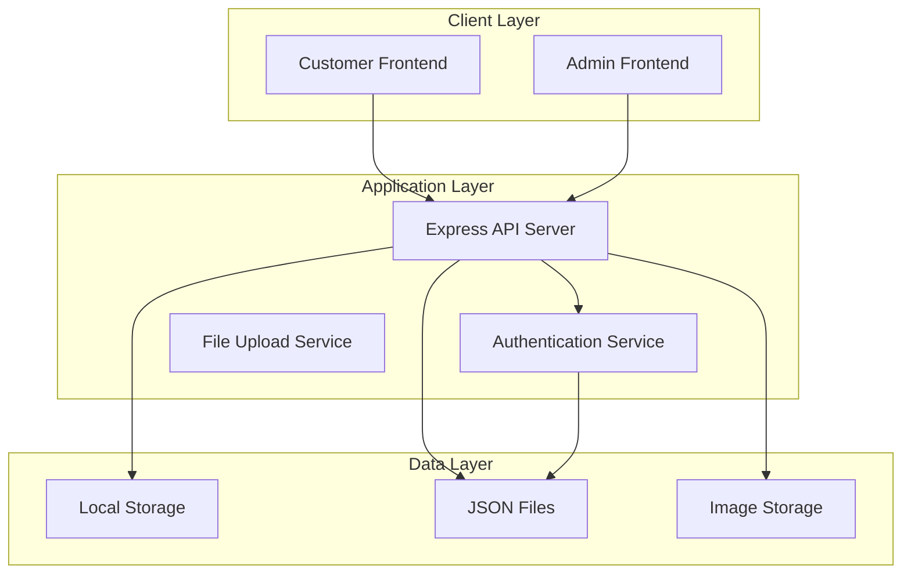
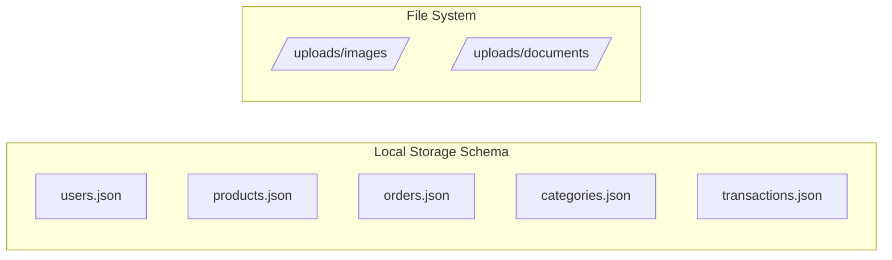
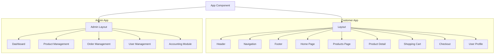
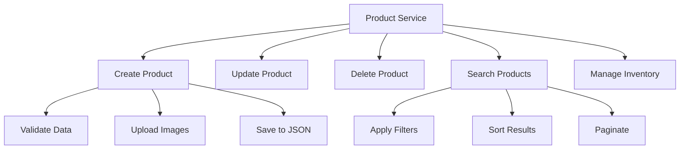
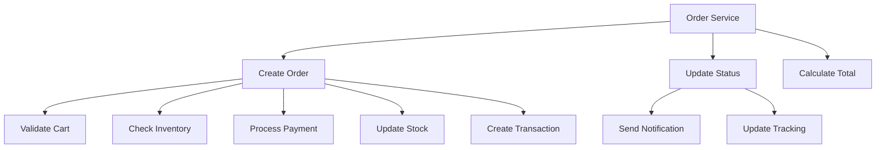
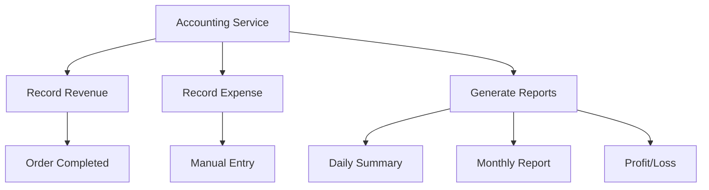
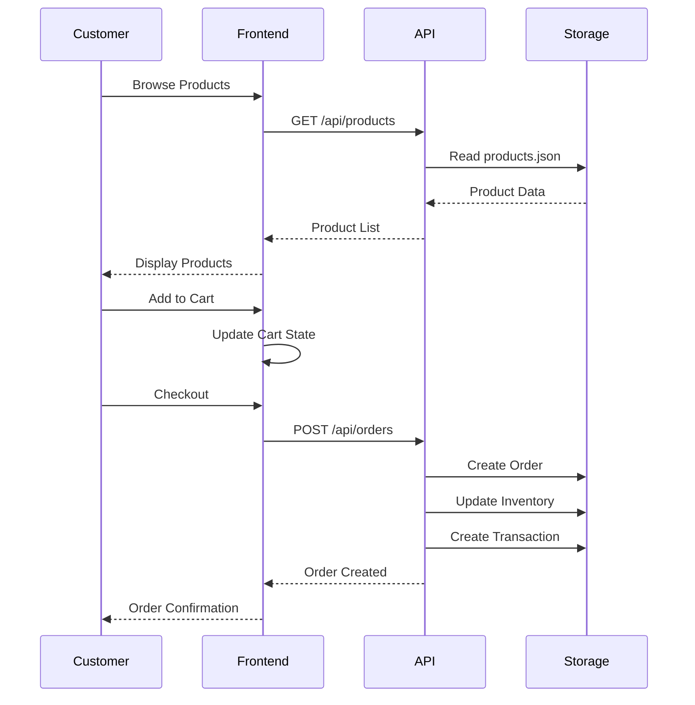
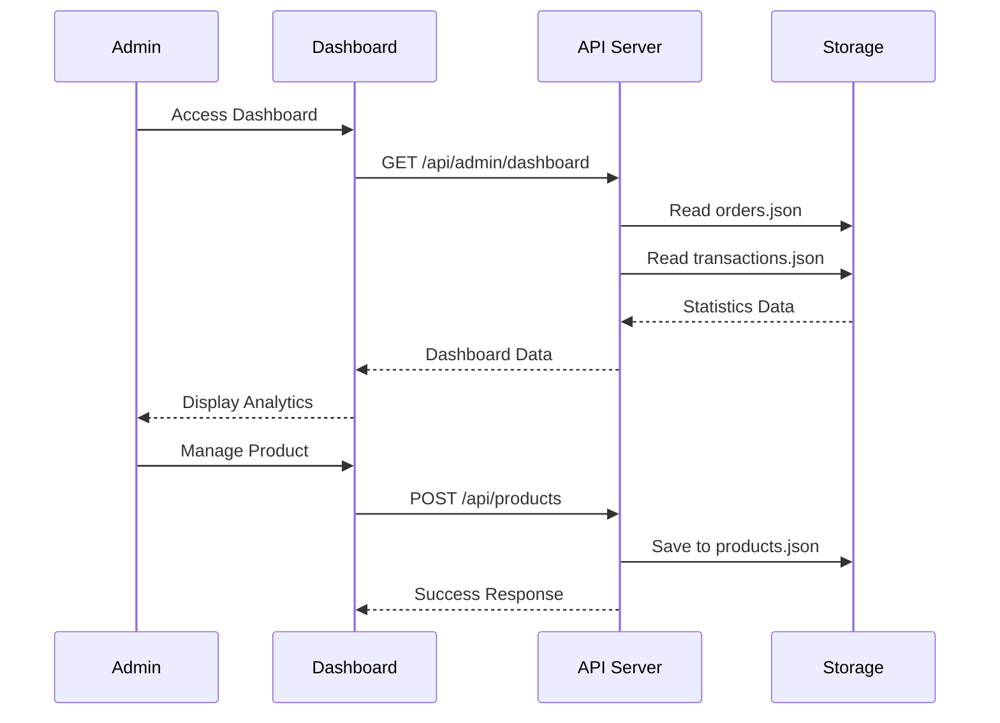

# Full-Stack Ecommerce Web Application Design

## Overview

A comprehensive ecommerce web application inspired by AliExpress design, featuring customer shopping interface, admin dashboard, and integrated accounting module. The system uses local storage as the primary database solution for simplified deployment and maintenance.

### Key Features
- Customer-facing ecommerce storefront
- Admin dashboard for product and order management
- Integrated accounting module for financial tracking
- AliExpress-inspired UI/UX design
- Local storage-based data persistence

### Target Users
- **Customers**: Browse products, manage cart, place orders, track purchases
- **Administrators**: Manage products, orders, customers, and view analytics
- **Accountants**: Track revenue, expenses, generate financial reports

## Technology Stack & Dependencies

### Frontend Framework
- **React 18** with TypeScript for type safety
- **Next.js 14** for SSR and routing capabilities
- **Tailwind CSS** for utility-first styling
- **Headless UI** for accessible components
- **React Hook Form** for form management
- **Zustand** for lightweight state management

### Backend Framework
- **Node.js** with Express.js
- **TypeScript** for type consistency
- **JSON file system** for local storage database
- **Multer** for file upload handling
- **JWT** for authentication

### UI Libraries
- **Ant Design** components for admin dashboard
- **Lucide React** for iconography
- **React Hot Toast** for notifications
- **Swiper** for product carousels

## Architecture

### System Architecture



### Data Storage Structure



## Frontend Architecture

### Component Hierarchy



### State Management

#### Global State (Zustand)

| Store | Purpose | Key States |
|-------|---------|------------|
| `authStore` | User authentication | `user`, `isAuthenticated`, `token` |
| `cartStore` | Shopping cart | `items`, `total`, `itemCount` |
| `productStore` | Product data | `products`, `categories`, `filters` |
| `orderStore` | Order management | `orders`, `currentOrder` |
| `adminStore` | Admin dashboard | `stats`, `recentOrders`, `notifications` |

#### Component State (useState/useReducer)
- Form inputs and validation states
- Modal visibility states
- Loading and error states
- Local UI state (tabs, accordions, etc.)

### Routing & Navigation

#### Customer Routes
| Route | Component | Description |
|-------|-----------|-------------|
| `/` | HomePage | Product showcase, categories |
| `/products` | ProductsPage | Product listing with filters |
| `/products/:id` | ProductDetail | Individual product view |
| `/cart` | CartPage | Shopping cart management |
| `/checkout` | CheckoutPage | Order placement |
| `/profile` | ProfilePage | User account management |
| `/orders` | OrdersPage | Order history |

#### Admin Routes
| Route | Component | Description |
|-------|-----------|-------------|
| `/admin` | Dashboard | Analytics and overview |
| `/admin/products` | ProductManagement | CRUD operations for products |
| `/admin/orders` | OrderManagement | Order processing |
| `/admin/users` | UserManagement | Customer management |
| `/admin/accounting` | AccountingModule | Financial tracking |

### Styling Strategy

#### Design System (AliExpress-inspired)
- **Primary Colors**: Orange (#FF6A00), Blue (#0066CC)
- **Typography**: Inter font family
- **Spacing**: 4px base unit system
- **Border Radius**: 8px standard, 4px small
- **Shadows**: Layered shadow system

#### Component Styling
```css
/* Tailwind custom configuration */
theme: {
  colors: {
    primary: '#FF6A00',
    secondary: '#0066CC',
    accent: '#FFB84D',
    neutral: '#F5F5F5'
  },
  fontFamily: {
    sans: ['Inter', 'sans-serif']
  }
}
```

## Backend Architecture

### API Endpoints Reference

#### Authentication Endpoints
| Method | Endpoint | Description | Request Body |
|--------|----------|-------------|--------------|
| POST | `/api/auth/register` | User registration | `{ email, password, name }` |
| POST | `/api/auth/login` | User login | `{ email, password }` |
| POST | `/api/auth/logout` | User logout | `{}` |
| GET | `/api/auth/me` | Get current user | - |

#### Product Endpoints
| Method | Endpoint | Description | Request Body |
|--------|----------|-------------|--------------|
| GET | `/api/products` | Get all products | Query: `?category&search&page` |
| GET | `/api/products/:id` | Get product by ID | - |
| POST | `/api/products` | Create product (Admin) | `{ name, price, description, images }` |
| PUT | `/api/products/:id` | Update product (Admin) | `{ name, price, description }` |
| DELETE | `/api/products/:id` | Delete product (Admin) | - |

#### Order Endpoints
| Method | Endpoint | Description | Request Body |
|--------|----------|-------------|--------------|
| GET | `/api/orders` | Get user orders | - |
| POST | `/api/orders` | Create new order | `{ items, shippingAddress, paymentMethod }` |
| GET | `/api/orders/:id` | Get order details | - |
| PUT | `/api/orders/:id/status` | Update order status (Admin) | `{ status }` |

#### Admin Endpoints
| Method | Endpoint | Description | Request Body |
|--------|----------|-------------|--------------|
| GET | `/api/admin/dashboard` | Dashboard statistics | - |
| GET | `/api/admin/users` | Get all users | - |
| GET | `/api/admin/accounting/summary` | Financial summary | - |
| GET | `/api/admin/accounting/transactions` | Transaction history | - |

### Data Models & Local Storage Schema

#### User Model
```typescript
interface User {
  id: string;
  email: string;
  password: string; // hashed
  name: string;
  role: 'customer' | 'admin';
  avatar?: string;
  addresses: Address[];
  createdAt: string;
  updatedAt: string;
}
```

#### Product Model
```typescript
interface Product {
  id: string;
  name: string;
  description: string;
  price: number;
  discountPrice?: number;
  images: string[];
  category: string;
  stock: number;
  specifications: Record<string, string>;
  rating: number;
  reviewCount: number;
  tags: string[];
  createdAt: string;
  updatedAt: string;
}
```

#### Order Model
```typescript
interface Order {
  id: string;
  userId: string;
  items: OrderItem[];
  status: 'pending' | 'confirmed' | 'shipped' | 'delivered' | 'cancelled';
  total: number;
  shippingAddress: Address;
  paymentMethod: string;
  trackingNumber?: string;
  createdAt: string;
  updatedAt: string;
}
```

#### Transaction Model (Accounting)
```typescript
interface Transaction {
  id: string;
  orderId?: string;
  type: 'revenue' | 'expense' | 'refund';
  amount: number;
  description: string;
  category: string;
  date: string;
  createdAt: string;
}
```

### Business Logic Layer

#### Product Management Service


#### Order Processing Service


#### Accounting Service


### Middleware & Interceptors

#### Authentication Middleware
- JWT token validation
- Role-based access control
- Session management

#### Request Validation
- Input sanitization
- Schema validation using Joi
- File upload validation

#### Error Handling
- Global error handler
- Structured error responses
- Logging integration

## Data Flow Between Layers

### Customer Purchase Flow


### Admin Management Flow


## Testing Strategy

### Unit Testing
- **Jest** for business logic testing
- **React Testing Library** for component testing
- **Supertest** for API endpoint testing

### Integration Testing
- API integration tests
- Database operation tests
- Authentication flow tests

### End-to-End Testing
- **Playwright** for user journey testing
- Critical path testing (purchase flow)
- Admin dashboard functionality

### Test Coverage Areas
- User authentication and authorization
- Product CRUD operations
- Order processing workflow
- Cart functionality
- Search and filtering
- Accounting calculations
- File upload operations

## Security Considerations

### Authentication & Authorization
- JWT token-based authentication
- Password hashing with bcrypt
- Role-based access control (RBAC)
- Session timeout management

### Data Protection
- Input validation and sanitization
- XSS protection
- CSRF protection
- File upload security

### API Security
- Rate limiting
- Request size limits
- CORS configuration
- Security headers

## Performance Optimization

### Frontend Optimization
- Code splitting with React.lazy
- Image optimization and lazy loading
- Memoization for expensive calculations
- Virtual scrolling for large lists

### Backend Optimization
- Response caching
- File compression
- Efficient JSON file operations
- Background job processing

### Storage Optimization
- JSON file indexing strategy
- Regular data cleanup
- Image compression
- Backup mechanisms